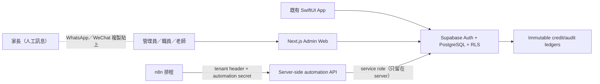

# 架構

## 邊界

PostgreSQL 是唯一 system of record。Admin Web 的一般使用者查詢沿用登入 JWT 與 RLS；只有 `/api/automation/*` 在驗證 tenant-scoped secret 後使用 server-only service role。n8n 永遠不持有 service role key。

## Tenant 與權限

- 每項營運資料都有 `organization_id`。
- `organization_members` 設定 `admin`、`staff`、`teacher`。
- admin：設定、角色、財務、audit 及所有營運操作。
- staff：學生、班別、收費、請假、補課、跟進等日常操作；不能提升角色。
- teacher：只讀自己班別／今日課堂，並透過 RPC 點名。
- RLS 同時檢查 organization membership 及角色；service role endpoint 仍必須以 organization filter/RPC 執行，避免以 service role 當作 tenant 邊界。

## 交易及冪等

- 報讀、套票購買及 initial ledger entry 在 transaction RPC 完成。
- 點名以 `(session_id, student_id)` 唯一，扣堂以 organization-scoped idempotency key 唯一。
- 付款、扣堂、退堂、補回、補課完成只 append ledger/transaction，不直接修改餘額。
- 請假核准、補課資格、排補課及完成狀態由 transaction RPC 保持一致。
- automation 以 `organization + job_type + period_key + subject` 去重。

## 訊息與 AI fallback

系統儲存繁體中文建議文字及 communication log。MVP 不含外部發送 provider。若日後設定 AI provider，只可改善草稿；沒有 provider 或 provider 失敗時使用確定性模板，且不影響任務建立。

## 兼容策略

不破壞原有 `parent_profiles`、`children`、`bookings`、`exam_cohorts`、`cohort_students`、`makeup_tasks` 和 SwiftUI DTO。migration 建立 legacy organization並回填 `organization_id`；新通用欄位／表逐步成為營運真相。舊 booking/notification 功能繼續可用，新流程採用 enrollment、ledger、charge/payment 及 audit 關聯。

