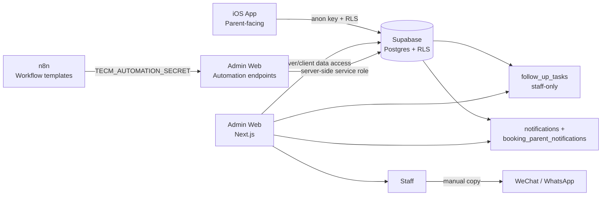
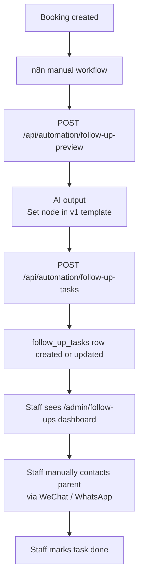
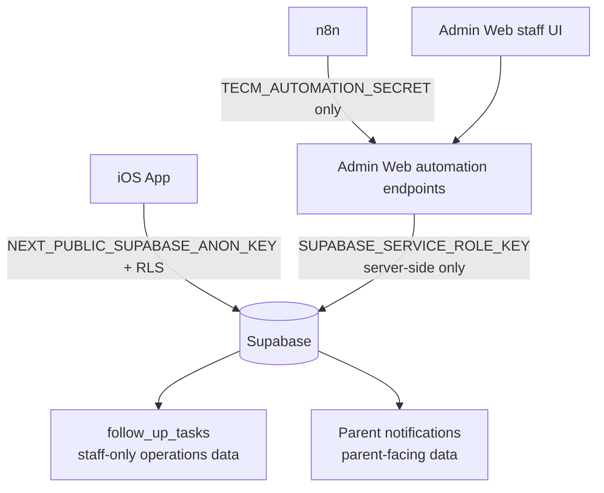

# TECM Architecture Overview

## 1. System architecture

## 2. Follow-up workflow

## 3. Security boundary

## Boundary notes

- n8n only has `TECM_AUTOMATION_SECRET`.
- Admin Web server has `SUPABASE_SERVICE_ROLE_KEY`.
- iOS uses anon key + RLS.
- `follow_up_tasks` are staff-only operational records.
- Parent notifications are separate parent-facing records.
- v1 does not implement direct WeChat auto-send, Supabase realtime triggers, database webhooks, or production auto-run.
